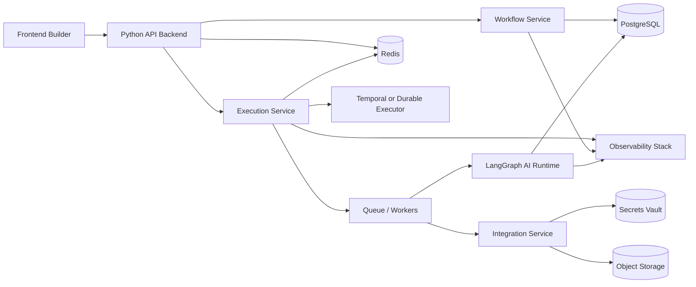

# AI Workflow Builder Architecture

## 1. Purpose

This document defines the target architecture for the product: an AI-native workflow builder and executor that is reliable enough for production use and flexible enough to support human steps, automation steps, and AI agent steps.

The plan is backend-first. The frontend will be built or expanded only when the corresponding backend capability exists.

## 2. Goals

- Build a durable workflow execution platform.
- Support human approvals, automations, and AI-driven steps in the same workflow.
- Keep workflow definitions versioned, auditable, and tenant-aware.
- Make execution observable, replayable, and recoverable.
- Use Python for the backend and LangGraph for AI orchestration.

## 3. Non-Goals For The First Cut

- No full frontend rewrite up front.
- No Go backend.
- No hand-rolled distributed workflow engine.
- No custom agent runtime if LangGraph already solves the AI orchestration problem.
- No enterprise SSO on day one unless it is needed for the first customer.

## 4. Core Decision

### Backend language
Use Python.

Why:

- LangGraph is a Python-first ecosystem.
- The AI tooling ecosystem is stronger in Python.
- A small team can ship faster in Python than in Go for this problem.
- Most execution time in this product will be spent waiting on APIs, LLMs, queues, and humans, not raw CPU.

### AI orchestration
Use LangGraph for AI agent subflows and stateful AI steps.

Do not use LangGraph as the entire backend platform. It should be the AI workflow layer inside a broader application backend.

### Workflow durability
Use a durable execution system such as Temporal for the product-level workflow engine.

Reason:

- retries
- timers
- pause/resume
- long-running runs
- idempotency
- recovery after crashes

LangGraph handles agent orchestration well. Temporal handles mission-critical workflow execution better.

## 5. High-Level Architecture



## 6. Service Boundaries

### 6.1 API Backend

Responsibilities:

- authentication and authorization
- workflow CRUD
- versioning and publishing
- run creation and run inspection
- node and edge schema validation
- tenant and workspace management
- public API for the frontend

### 6.2 Workflow Service

Responsibilities:

- store workflow definitions
- validate DAG structure
- compile workflow definitions into executable plans
- publish immutable workflow versions
- manage draft vs published state

### 6.3 Execution Service

Responsibilities:

- start workflow runs
- orchestrate step execution
- manage retries, timeouts, and failures
- persist execution state
- emit run events and logs
- support pause, resume, cancel, and replay

### 6.4 AI Runtime

Responsibilities:

- run LangGraph graphs for AI steps
- manage prompts, tool calls, and structured outputs
- maintain AI step state
- expose traceable inputs and outputs
- support human-in-the-loop interruption points

### 6.5 Integration Service

Responsibilities:

- connect to external apps and APIs
- manage credentials
- normalize connector behavior
- run webhooks and polling jobs
- wrap third-party failures in product-level errors

### 6.6 Worker Layer

Responsibilities:

- execute background tasks
- run queued jobs
- process retries and delayed tasks
- perform async calls to LLMs and external services

## 7. Data Stores

### PostgreSQL

Primary system of record for:

- users
- workspaces
- workflows
- workflow versions
- workflow runs
- step runs
- audit logs
- templates
- connector metadata

### Redis

Use for:

- queues
- short-lived locks
- rate limiting
- cached execution state
- ephemeral coordination

### Object Storage

Use for:

- large run payloads
- attachments
- exported workflow bundles
- logs and artifacts

### Secrets Vault

Use for:

- API keys
- OAuth tokens
- service credentials
- environment-specific secrets

## 8. Workflow Model

### Workflow Definition

Each workflow should have:

- `workflow_id`
- `name`
- `description`
- `workspace_id`
- `current_version`
- `status` (`draft`, `published`, `archived`)

### Workflow Version

Each version should be immutable once published and contain:

- nodes
- edges
- metadata
- validation snapshot
- schema version
- published timestamp

### Workflow Run

Each run should store:

- workflow version reference
- trigger source
- execution status
- start and end timestamps
- step-level logs
- step outputs
- error details
- retry history

### Step Types

Start with these:

- trigger
- human approval
- task
- HTTP request
- AI agent
- conditional branch
- end

## 9. Execution Flow

1. A user publishes a workflow version.
2. A trigger creates a workflow run.
3. The execution service loads the immutable version.
4. The executor resolves the next node.
5. If the node is deterministic, it runs in a worker.
6. If the node is AI-driven, the AI runtime executes a LangGraph graph.
7. If the node needs human input, the run pauses.
8. Events and state are persisted after every meaningful transition.
9. The run completes, fails, or remains waiting.

## 10. LangGraph Usage

LangGraph should be used for:

- AI agent nodes
- tool-calling chains
- stateful reasoning loops
- human-in-the-loop AI steps
- structured AI output generation
- AI subflows inside a larger workflow

LangGraph should not own:

- tenant management
- general workflow CRUD
- billing
- auth
- connector management
- the whole execution platform

## 11. Proposed Backend Modules

Suggested Python package layout:

```text
backend/
  app/
    api/
    auth/
    workflows/
    executions/
    connectors/
    ai/
    audit/
    common/
    models/
    schemas/
    workers/
  tests/
  migrations/
  pyproject.toml
```

## 12. API Surface

We will design API endpoints incrementally as the backend is built.

Rules:

- implement obvious CRUD and run lifecycle endpoints as we reach them
- stop and discuss first for endpoints that affect execution semantics, security, billing, or data retention
- keep the API consistent with the workflow and run models already committed to the database

Initial API groups:

- `POST /auth/login`
- `POST /auth/logout`
- `GET /workflows`
- `POST /workflows`
- `GET /workflows/{id}`
- `PUT /workflows/{id}`
- `POST /workflows/{id}/publish`
- `POST /runs`
- `GET /runs/{id}`
- `POST /runs/{id}/cancel`
- `POST /runs/{id}/resume`
- `GET /connectors`
- `POST /connectors/{id}/test`
- `GET /audit`

## 13. Frontend Contract

The frontend should only do the following:

- render workflow graphs
- edit workflow definitions
- start and inspect runs
- display validation and run state
- request backend actions through APIs

The frontend should not:

- simulate production execution logic
- store durable business state locally
- decide workflow semantics on its own

## 14. Production Concerns

These are required before calling the system production ready:

- auth and RBAC
- tenant isolation
- durable execution
- audit logging
- observability
- retry and timeout policy
- idempotency
- secrets encryption
- run replay
- rate limits
- backup and restore
- CI/CD
- integration test coverage

## 15. Build Order

### Phase A: Backend foundation

- Python API
- database schema
- auth
- workflow CRUD
- versioning

### Phase B: Execution core

- run lifecycle
- durable executor
- step persistence
- retries and timeouts
- logs and events

### Phase C: AI layer

- LangGraph integration
- AI step execution
- tool calling
- structured outputs
- human-in-the-loop interruptions

### Phase D: Connectors

- HTTP
- webhook
- email
- Slack
- calendar
- document generation
- connector SDK TODO for later, once connector volume and patterns are clearer

### Phase E: Frontend expansion

- bind UI to backend APIs
- replace mock behavior
- add run history and inspection
- add publish flow and version history

## 16. Recommended Stack

- Backend: Python
- API framework: FastAPI
- DB: PostgreSQL
- Cache/queue: Redis
- Durable orchestration: Temporal
- AI orchestration: LangGraph
- LLM framework helpers: LangChain only where needed
- Object storage: S3-compatible storage
- Observability: OpenTelemetry plus a metrics/log stack

## 17. Why FastAPI

FastAPI is the right default for this product because:

- it is API-first and fits a service-oriented backend well
- it has strong validation and OpenAPI support
- it works naturally with async I/O, workers, queues, and webhook handling
- it keeps the backend lighter than a full Django stack
- it pairs cleanly with Temporal and LangGraph

## 18. Connector Strategy

We will not design a full connector SDK yet.

That work stays as an explicit TODO until we have enough real connectors to see the recurring abstraction points.
For now, we build the first few connectors directly and extract a shared interface only when it starts paying for itself.

## 19. API Design Rule

We will not freeze every API contract before implementation.

Instead:

- obvious endpoints get designed and implemented as needed
- delicate endpoints get discussed before coding
- any API that changes execution semantics, security boundaries, or data retention must be reviewed first

This keeps us moving without locking the whole product into speculative contracts too early.

## 20. What We Are Not Choosing

We are not using Django as the primary backend framework for this version.

That does not mean Django is bad. It means the current product shape favors a smaller, service-first backend rather than a full Django monolith.

## 21. Guiding Principle

If a feature is about AI reasoning, use LangGraph.

If a feature is about workflow reliability, use the backend and durable executor.

If a feature is about product structure, use normal application code.
